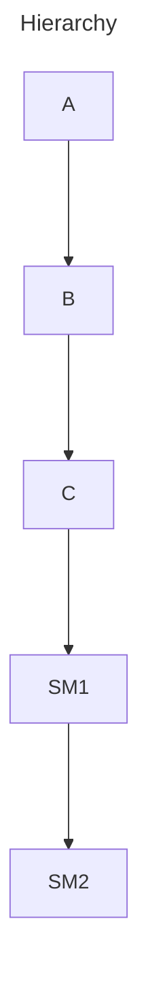

# Cat-State

This project is done as a POC for integrating CAC into a haskell project.

This project uses tree-like hierarchy, and overrides the config for the lowest child.

## TODO

- [ ] Create a provider using open feature provider.
- [ ] using the provider load all the config from the backend.
- [ ] Build a tree [hierarchy](README#Hierarchy)
- [ ] Create a new config key
- [ ] Evaluate [scenarios](README#Scenario) with this config key.

----

## Hierarchy

----

## Scenario

- Assume key to be: isV2Enabled
- Default value: False
- Schema: Bool
- A: `ten`, B: `res`, C: `mer`, SM1: `subm1`, SM2: `subm2`

1. Current User: `subm2`
   Overrides:
    context.A == `ten`, then isV2Enabled = True
    context.SM1 == `subm1`, then isV2Enabled = False
   Expected Resolved config:
    isV2Enabled = False
2. Current User: `mer`
   Overrides:
    context.A == `ten`, then isV2Enabled = True
    context.SM1 == `subm1`, then isV2Enabled = False
   Expected Resolved config:
    isV2Enabled = True
