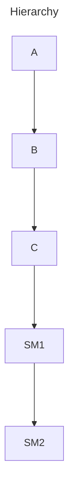

# Cat-State

This project is done as a POC for integrating CAC into a haskell project.

This project uses tree-like hierarchy, and overrides the config for the lowest child.

## Open Feature Provider Usage

- Create a Provider.
- Initialize the provider.
- Set the provider.
- Store it in app and use it whenever you want.
- The feature provider has functions from [open-feature-haskell-sdk](https://github.com/juspay/open-feature-haskell-sdk):

    ```haskell
        class FeatureProvider p where
          getMetadata :: p -> ProviderMetadata

          getStatus :: p -> IO ProviderStatus

          initialize :: p -> EvaluationContext -> IO ()

          -- | Evaluate a boolean flag
          resolveBooleanValue ::
            p ->
            Text ->
            EvaluationContext ->
            IO (EvaluationResult (ResolutionDetails Bool))

          -- | Evaluate a string flag
          resolveStringValue ::
            p ->
            Text ->
            EvaluationContext ->
            IO (EvaluationResult (ResolutionDetails Text))

          -- | Evaluate an integer flag
          resolveIntegerValue ::
            p ->
            Text ->
            EvaluationContext ->
            IO (EvaluationResult (ResolutionDetails Integer))

          -- | Evaluate a double flag
          resolveDoubleValue ::
            p ->
            Text ->
            EvaluationContext ->
            IO (EvaluationResult (ResolutionDetails Double))

          -- | Evaluate an object flag
          resolveObjectValue ::
            p ->
            Text ->
            EvaluationContext ->
            IO (EvaluationResult (ResolutionDetails Value))
    ```

## TODO

- [x] Create a provider using open feature provider.
- [x] using the provider load all the config from the backend.
- [x] Build a tree [hierarchy](README#Hierarchy)
- [x] Create a new config key
- [ ] Evaluate [scenarios](README#Scenario) with this config key.

----

## Hierarchy



----

## Scenario

- Assume key to be: k1
- Default value: 10
- Schema: Bool
- A: `Te`, B: `Re`, C: `CT`, SM1: `CT1`, SM2: `CT2`

1. Current User: `CT2`
   Overrides:
    context.A == `te`, then k1 = 23
    context.C == `CT`, then k1 = 66
   Expected Resolved config:
    k1 = 66
2. Current User: `CT`
   Overrides:
    context.A == `Te`, then isV2Enabled = True
    context.SM1 == `CT1`, then isV2Enabled = False
   Expected Resolved config:
    isV2Enabled = True
